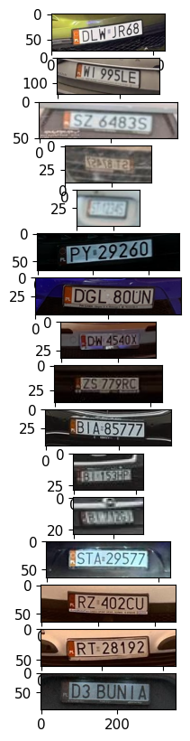
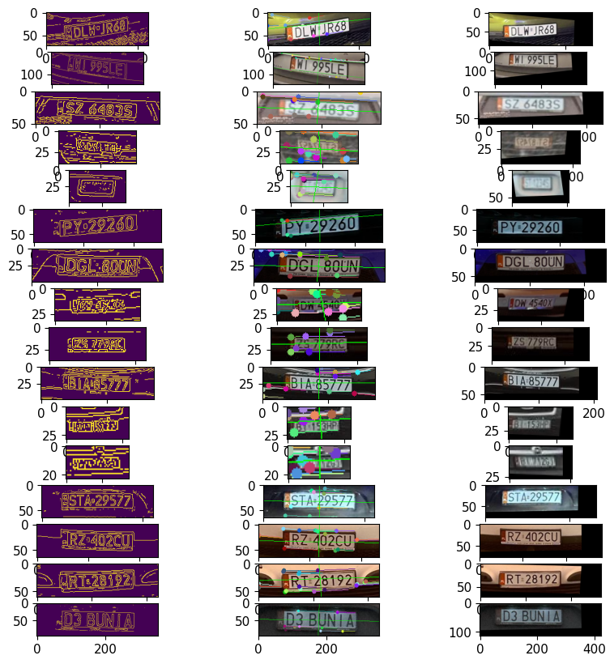
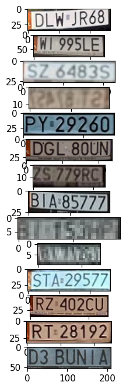
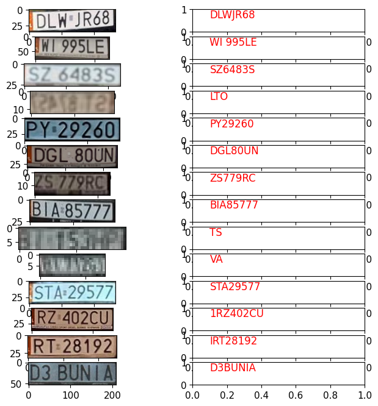
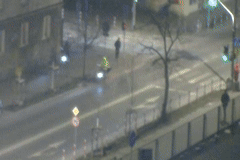
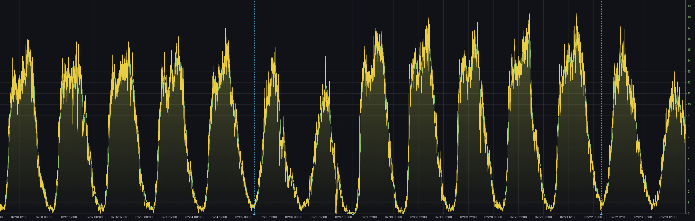
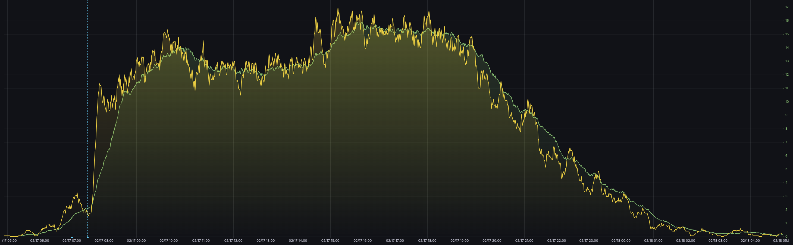
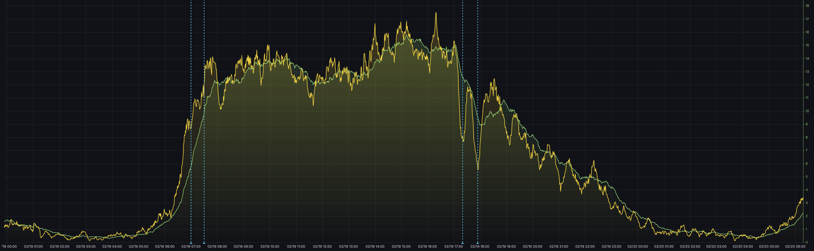

# CV_course_project

As a final part of my Laba.IT Computer Vision project I decided to work on car-related topics:

- Automatic License Plate Recognition

- Trafic data collection suite

## Automatic License Plate Recognition


### Genesis 

I was trying to find a robust way to detect and read license plates for a bigger project related to a car-computer used for gathering driving data. This turned out to be a big task and wasn't as easy as supposed. 

Back in the day I tried using ready-made ALPR systems like openALPR or Plate Recognizer. Both turned out to be ok, but quite pricy. 

That's why for part of my final project I decided to write my own ALPR solution. 

### Source data

For license plates I used a portal that has Polish license plates - [tablica-rejestracyjna.pl](https://tablica-rejestracyjna.pl/). It contains a lot of images of cars (which contain license plates). I decided to use following images for development:

- [image](https://tablica-rejestracyjna.pl/images/photos/20241217184503.jpeg)
- [image](https://tablica-rejestracyjna.pl/images/photos/20241222194356.jpeg)
- [image](https://tablica-rejestracyjna.pl/images/photos/20241221145937.jpg)
- [image](https://tablica-rejestracyjna.pl/images/photos/20241220211840_1.jpeg)
- [image](https://tablica-rejestracyjna.pl/images/photos/20241226000931.png)
- [image](https://tablica-rejestracyjna.pl/images/photos/20241222132622.jpg)
- [image](https://tablica-rejestracyjna.pl/images/photos/20241223133614.jpg)
- [image](https://tablica-rejestracyjna.pl/images/photos/20241231224738.jpeg)
- [image](https://tablica-rejestracyjna.pl/images/photos/20250106155050.jpeg)
- [image](https://tablica-rejestracyjna.pl/images/photos/20250106153417.jpeg)


### License plate recognition 

Using [Yolov5m pretrained to detect registration](https://huggingface.co/keremberke/yolov5m-license-plate) I detected the license plates:



This step wasn't enough, since skewed images didn't get read properly by tesseract or openOCR, since bounding boxes didn't select license-plates-only, but rather license plates and additional parts due to being not straight. Shortly speaking, the images were poor quality, since they were skewed.

These images already had additional 30% margins added on each side. This was added in later stage, but basically it allows to add more visual features of the car that are usually paralel to registration edges.

### Deskewing 

After that I applied Canny edge detector resulting in edged images.

With this, it was possible to find continous lines using
``` python
lsd = cv2.createLineSegmentDetector()
lsd.detect(edges)
```

This resulted (after filtering) with detected line segments. This, in turn enabled me to calculate the average angle of horizontal and vertical lines. With this information it was possible to deskew images with apropriate warp transform:
```python
src = np.array([[0, 0], 
                [w, +w*horizontalSkew], 
                [w + h * verticalSkew, h + w*horizontalSkew],
                [h * verticalSkew, h]], dtype=np.float32)
dst = np.array([[0, 0], [w, 0], [w, h], [0, h]], dtype=np.float32)
M = cv2.getPerspectiveTransform(src, dst)
warp = cv2.warpPerspective(plate, M, (int(w*1.2), int(h*1.2)))
```

This resulted in a deskewed images:




### Getting clean images of license plates

After getting clean, straight images, it was only required to run Yolov5 detector for license plates once again. This resulted in clean images of license plates:




This meant I was ready to read license plate symbols.

### Reading letters from license plates

After testing both solutions (tesseract and openOCR) I settled on tesseract called with pytesseract package. This didn't always work perfectly but I was happy with the result:



In case of unreadable plates it was obvious the data wasn't correct, but in 11 cases of humanly-readable plates the chosen method achieved correct results in 9 cases yielding 81% accuracy. 


### Options to expand this project

1. Trying to run this software not as a Jupyter notebook, but rather as a continuous loop parsing a video

2. Using this software to track registration plates live on a Traffic data collection suite 

3. Using this software in a car-computer to note cars town-of-origin or give intel to the driver about seeing a registration seen in the past


## Trafic data collection suite

I built a Trafic data collection suite for my own curiosity. I was interested in understanding traffic patterns on a street near where I live. Built this trying to get insight on 
when is it enticing to go to work or come back from it to avoid staying in traffic.

### Handling the camera

The system is comprised of:

- Jetson Orin Xavier NX - a Nvidia ARM-based embedded computer

- Raspberry Pi HQ Camera based on IMX477R sensor

- a Fujian 35mm f1.7 TV lens with C type mounting

The camera+lens combination was really important to consider at the beginning of the project. Correct choice made it easy to go further because of proper framing of the intersection I could see from my window.
For this I watched endless Youtube videos comparing different camera+lens combinations while calculating what field of view was available with each combination. After I found the correct combo I decided to buy 
components for this project. 

Getting the image from the camera connected over CSI connector also wasn't as easy as always. I had to configure my Jetson computer properly in order to get the camera to work. Besides the configuration there was
also issue with opening the camera and reading images. This required use of Gstreamer, since it's the only "normal" way to get the video. There are a few different ways one can go around reading images with Gstreamer
in python, however I decided to use one, where I call Gstreamer through gi.repository. I went this way instead of using OpenCV with GST, because in order to do this, I'd have to compile OpenCV from source with correct
flags to get it to work properly, which is tedious.. I landed on a Camera class which provides me with a clean interface and a good abstraction layer:

``` python

def gst_to_opencv(sample):
    """Convert GStreamer sample to OpenCV image"""
    buf = sample.get_buffer()
    caps = sample.get_caps()
    
    height = caps.get_structure(0).get_int('height')[1]
    width = caps.get_structure(0).get_int('width')[1]
    
    # Extract frame data
    success, map_info = buf.map(Gst.MapFlags.READ)
    if not success:
        return None
    
    # Convert to numpy array
    frame = np.frombuffer(map_info.data, dtype=np.uint8).reshape((height, width, 4))
    buf.unmap(map_info)
    return frame

class CSI_Camera:
    def __init__(self):
        self.pipeline = Gst.parse_launch(
            "nvarguscamerasrc sensor-id=0 ! video/x-raw(memory:NVMM), width=1920, height=1080 ! nvvidconv ! video/x-raw, format=RGBA ! appsink name=appsink emit-signals=true max-buffers=1 drop=true"
        )
        self.det = Yolov5Detector()

        self.appsink = self.pipeline.get_by_name("appsink")
        self.appsink.connect("new-sample", self.on_new_sample)
        self.latest_frame = None
    
    def on_new_sample(self, sink):
        """Callback when a new frame is available"""
        sample = sink.emit("pull-sample")
        frame = gst_to_opencv(sample)
        if frame is not None:
            frame = cv2.cvtColor(frame, cv2.COLOR_RGBA2BGR)
            frame = cv2.rotate(frame, cv2.ROTATE_180)
            frame = self.det.infere(frame)
            self.latest_frame = frame
        return Gst.FlowReturn.OK
    
    def start(self):
        self.pipeline.set_state(Gst.State.PLAYING)
    
    def stop(self):
        self.pipeline.set_state(Gst.State.NULL)
    
    def get_latest_frame(self):
        return self.latest_frame
```


### Car detections and tracking 

For tracking cars and their movements 2 things had to be done:

1. detecting a car

2. tracking detections (cars) between consecutive frames

#### Car detection 

For first problem I decided to use industry standard and went with Yolov5. 
This was really easy except for the fact that installing pytorch is a quirky process when dealing with embedded devices, especially because of required GPU/CUDA support on Jetson.
Using Yolov5 in code is really easy and intuitive:
``` python
results = self.model(frame)
for *box, conf, cls in detections:
    class_names = self.model.names
    name = class_names[int(cls)]
    x1, y1, x2, y2 = map(int, box)  # Convert coordinates to integers
    if(conf > 0.5):
        if(name == "car"):
            listForTracker.append(Detection(box=[x1, y1, x2, y2]))
```

This code finds cars on the current frame and adds their positions (bounding boxes in xyxy format) to an array. 
The results are also filtered ensuring confidence of the detection is greater than 50%.

#### Why do we need a tracker though?

Detections by themselves (in principle) are singular, unrelated boxes, that don't give any information about movement of 
an object. There has to be a connection between detections of each car between frames to reason, that the detected car is moving.
There is also the issue of not having detections of a car on each frame the car appears in. All of these issues can be solved
using a tracking algorithm that can handle multiple objects in one image. The tracker makes it easy to connect the bounding boxes
between concurrent frames making it possible to track movement, instead of (in detection-only case) just pointing out the fact
that a car is in some place on the image. This was an insight I didn't have at the beginning of this project and undestood it
as soon as I tried to count cars that passed down the street.

Having the results of detected cars on current frame makes it much easier to track. Firstly I thought that I'd have to 
use a video tracker for each detection, but it turns out there are ready libraries that make it easy to track objects
based on their detected positions, often allowing to loose object for a couple frames between said detections. One
of the non-video-trackers I found is [Motpy](https://github.com/wmuron/motpy). The interface to use it is stupid-simple:
``` python
tracker.step(detections=[Detection(box=object_box)])
tracks = tracker.active_tracks()
print('MOT tracker tracks %d objects' % len(tracks))
print('first track box: %s' % str(tracks[0].box))
```

Having a tracker has an another benefit. Each of tracked objects has to have an individual ID, which in turn makes it easy to 
track changing position of a specific car (based on its ID). This in turn helps to calculate the difference of position for any 
currently tracked ID, giving way to estimating speed of each car. Notice the fact, that color of the track and bounding box denotes
currently estimated speed



### Getting those juicy graphs

In order to collect/store information about cars I needed a place to keep records of the fact that in a particular minute some amout of cars was tracked.
I basically needed a database. For this (and I knew it was a huge mistake) I stored the information in a large .json file using json format (duh). 
This was a bad Idea since the system had to write a big file frequently, which meant that it took a lot of time between processing of the image
frames. I basically did this, because I really wanted to see the graphs, and after making sure it was a bad idea (to write a DB software on the spot)
I switched to looking for a nice database software to handle that task for me. 

Since I wanted graphs I looked up what was Graphana natively supporting. This is when I saw that many people recommend InfluxDB. 
I hosted both of these on my homelab server (Influx + Graphana) and got everything set up. Wrote some basic (really basic) code for uploading 
data from vision software to a database and configured both elements to work properly.
Data that I'm sending is information about how many cars passed in the last minute, and (naturally) the code sends it every minute. 
I set up graphana dashboard so that main chart shows 2 plots:

- data averaged over last 10 minutes

- data averaged over last full hour

After a while I started seeing first results, but more importantly I could leave it for some time to gather more information for me to interpret.
These are example charts showing amount of traffic over time:


Yellow plot denotes data averaged over last 10 minute periods, blue markers indicate start and end of weekends

Studying a single day (Monday) we can note some interesting observations:

The blue lines denote 2 exact times:

- 7:00

- 7:30 

Observations:

1. This means that people rush to work at around 7:30, and the amount of cars grows very fast during this period. This means it could be beneficiary to leave home for work at around 7:15 to get there hassle free.

2. There is no "good time" to go back on monday. No "golden window", nothing. So it almost doesn't matter which time do I choose to go home


However studying plots from Wednesday we can see something quite different:

The blue lines denote 4 exact times:

- 7:00

- 7:30 

- 17:20

- 17:55

Observations:

1. The perfect time to go to work virtually doesn't exist, since people start going to work very early, and there is no dip in traffic at early hours

2. There are 2 dips in rush hour after 5pm, exactly at 17:20 and 17:55 where trafic goes down for a few minutes, and It could be a good idea to try arrive at that time home

These, and many more observations can be made in order to save time and effort in a daily commute to/from workplace or.. really any other place.

### Options to expand this project

1. Select a better camera/lens combination in order to be able to track/read/detect license plates

2. Use tracks position in order to differentiate trafic in both directions of the street

3. Save speed data for easier (maybe automatic) traffic jam detection