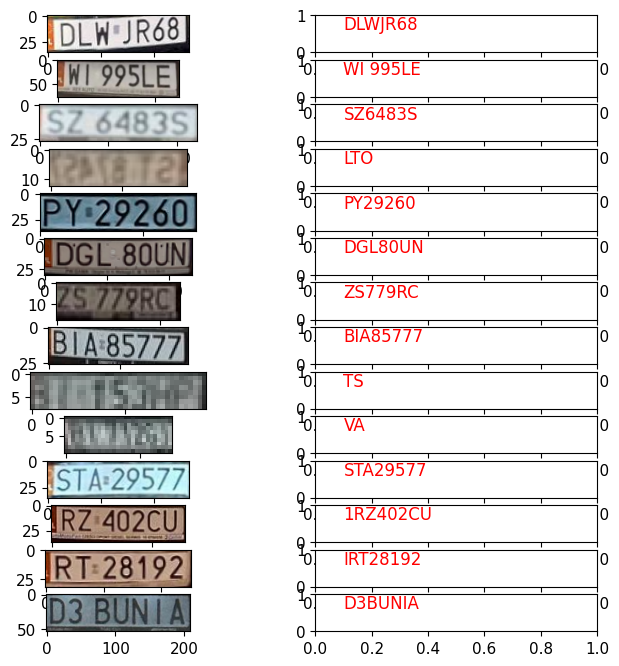

# CV_course_project

As a final part of my Laba.IT Computer Vision project I decided to work on car-related topics:

- Automatic License Plate Recognition

- Trafic data collection suite

## Automatic License Plate Recognition


### Genesis 

I was trying to find a robust way to detect and read license plates for a bigger project related to a car-computer used for gathering driving data. This turned out to be a big task and wasn't as easy as supposed. 

Back in the day I tried using ready-made ALPR systems like openALPR or Plate Recognizer. Both turned out to be ok, but quite pricy. 

That's why for part of my final project I decided to write my own ALPR solution. 

### Source data

For license plates I used a portal that has Polish license plates - [tablica-rejestracyjna.pl](https://tablica-rejestracyjna.pl/). It contains a lot of images of cars (which contain license plates). I decided to use following images for development:

- [image](https://tablica-rejestracyjna.pl/images/photos/20241217184503.jpeg)
- [image](https://tablica-rejestracyjna.pl/images/photos/20241222194356.jpeg)
- [image](https://tablica-rejestracyjna.pl/images/photos/20241221145937.jpg)
- [image](https://tablica-rejestracyjna.pl/images/photos/20241220211840_1.jpg)
- [image](https://tablica-rejestracyjna.pl/images/photos/20241226000931.png)
- [image](https://tablica-rejestracyjna.pl/images/photos/20241222132622.jpg)
- [image](https://tablica-rejestracyjna.pl/images/photos/20241223133614.jpg)
- [image](https://tablica-rejestracyjna.pl/images/photos/20241231224738.jpe)
- [image](https://tablica-rejestracyjna.pl/images/photos/20250106155050.jpeg)
- [image](https://tablica-rejestracyjna.pl/images/photos/20250106153417.jpeg)


### License plate recognition 

Using [Yolov5m pretrained to detect registration](https://huggingface.co/keremberke/yolov5m-license-plate) I detected the license plates:


This step wasn't enough, since skewed images didn't get read properly by tesseract or openOCR, since bounding boxes didn't select license-plates-only, but rather license plates and additional parts due to being not straight. Shortly speaking, the images were poor quality, since they were skewed.

These images already had additional 30% margins added on each side. This was added in later stage, but basically it allows to add more visual features of the car that are usually paralel to registration edges.

### Deskewing 

After that I applied Canny edge detector resulting in edged images.

With this, it was possible to find continous lines using
``` python
lsd = cv2.createLineSegmentDetector()
lsd.detect(edges)
```

This resulted (after filtering) with detected line segments. This, in turn enabled me to calculate the average angle of horizontal and vertical lines. With this information it was possible to deskew images with apropriate warp transform:
```python
src = np.array([[0, 0], 
                [w, +w*horizontalSkew], 
                [w + h * verticalSkew, h + w*horizontalSkew],
                [h * verticalSkew, h]], dtype=np.float32)
dst = np.array([[0, 0], [w, 0], [w, h], [0, h]], dtype=np.float32)
M = cv2.getPerspectiveTransform(src, dst)
warp = cv2.warpPerspective(plate, M, (int(w*1.2), int(h*1.2)))
```

This resulted in a deskewed images:


### Getting clean images of license plates

After getting clean, straight images, it was only required to run Yolov5 detector for license plates once again. This resulted in clean images of license plates:


This meant I was ready to read license plate symbols.

### Reading letters from license plates

After testing both solutions (tesseract and openOCR) I settled on tesseract called with pytesseract package. This didn't always work perfectly but I was happy with the result:



In case of unreadable plates it was obvious the data wasn't correct, but in 11 cases of humanly-readable plates the chosen method achieved correct results in 9 cases yielding 81% accuracy. 


## Car tracking